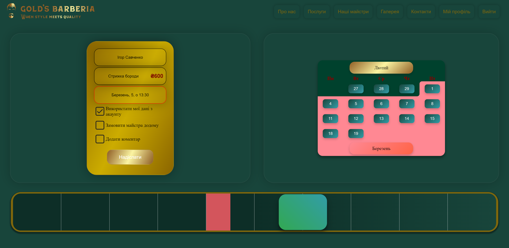
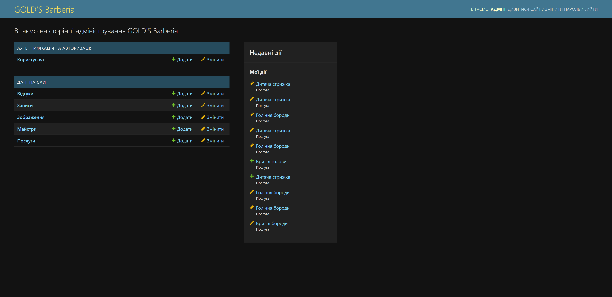

<h1>GOLD'S Barberia</h1>

Це проект, який ми розробляли протягом півроку в рамках курсової роботи з Технологій розроблення програмного забезпечення. На цьому сайті ми використовували Django та Google API.

<h2>Основні можливості</h2>
<ul>
    <li><strong>Авторизація</strong></li>
    <li><strong>Система запису на послугу</strong>: Унікальна система, розроблена мною</li>
    <li><strong>Сторінки послуг та майстрів</strong></li>
    <li><strong>Портфоліо</strong>: Адміністратор може додавати фото в портфоліо та редагувати інформацію про майстрів</li>
    <li><strong>Google Calendar</strong>: При записі на послугу всі дані відправляються у календарі майстрів</li>
</ul>
<h2>Скріншоти сторінок та посилання на них</h2>

    <h3>GOLD'S Barberia</h3>
    

    <h3>Сторінка запису на послугу</h3>
    

    <h3>Сторінка майстрів</h3>
    

    <h3>Сторінка послуг</h3>
    

    <h3>Адмінка сайту</h3>
     
    (на неї нема посилання, вхід до неї здійснюється через стандартний логін)

